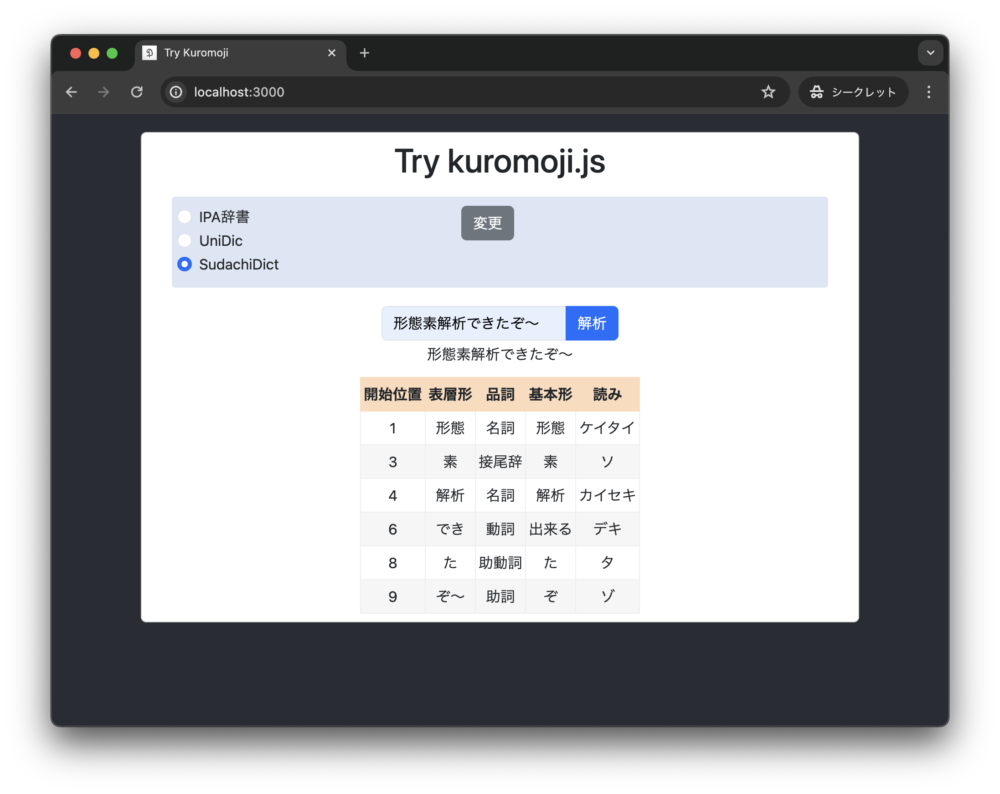

# React + Kuromoji.js で形態素解析

クライアントサイドで形態素解析するブラウザアプリです。

形態素解析器は [kuromoji.js](https://github.com/takuyaa/kuromoji.js)、辞書は [IPADic](https://github.com/taku910/mecab/tree/master/mecab-ipadic)、[UniDic](https://clrd.ninjal.ac.jp/unidic/back_number.html#unidic_cwj)、[SudachiDict](https://github.com/WorksApplications/SudachiDict) を利用しています。




## 起動手順
- Node.js v20
- 依存関係をインストール

```sh
cd kuromoji.js-react-app
npm install
```

- 開発用サーバーを起動

```sh
npm start
```


## 形態素解析用の辞書のビルド・セットアップ
- Node.js v10

## IPADic
npm でインストールした `kuromoji/dict/` 下のファイルを、 `public/` 下にディレクトリごとコピーする
```sh
cp -r node_modules/kuromoji/dict public/kuromoji-dict
```


## UniDic
- [「UniDic」国語研短単位自動解析用辞書 | バックナンバー](https://clrd.ninjal.ac.jp/unidic/back_number.html#unidic_cwj) から、フルパッケージ版 `unidic-cwj-202302_full.zip` をダウンロードして、 `./unidic-cwj-202302_full` に展開する
- 上記辞書ソースデータをビルドのためにコピー
```sh
cd node_modules/kuromoji/
sh ../../copy_unidic.sh
```
- ビルド
```sh
NODE_OPTIONS="--max-old-space-size=4096" npm run build-dict
```
- ビルドされた UniDic を、アプリケーションが参照できる位置にコピー
```sh
cp -r dict ../../public/kuromoji-dict-unidic
```
- 詳しい手順: [./docs/240309_kuromojijs_unidic.md](./docs/240309_kuromojijs_unidic.md)


### SudachiDict
- [WorksApplications/SudachiDict: A lexicon for Sudachi](https://github.com/WorksApplications/SudachiDict) の README にあるリンクから `*_lex.csv` と `matrix.def` をダウンロードして、`./sudachi-dict-20240109` 下に展開する
- [WorksApplications/Sudachi src/main/resources](https://github.com/WorksApplications/Sudachi/tree/develop/src/main/resources) から `char.def` と `unk.def` をダウンロードし、`./sudachi-dict-20240109` 下に配置する
- 上記辞書ソースデータをビルドのためにコピー
```sh
sh ../../copy_sudachidict.sh
```
- ビルド
```sh
npm run build-dict
```
- ビルドされた SudachiDict を、アプリケーションが参照できる位置にコピー
```sh
cp -r dict ../../public/kuromoji-dict-sudachi
```
- 詳しい手順: [./docs/240416_kuromojijs_sudachidict.md](./docs/240416_kuromojijs_sudachidict.md)


## 履歴

### 2024/04/16
- トークナイザ読み込みの前に、UIで辞書を選択するようにしました
- SudachiDict をコピーするスクリプト [`copy_sudachidict.sh`](./copy_sudachidict.sh) を追加
- Qiita で記事を公開しました：[kuromoji.js + SudachiDict で形態素解析（辞書のビルド、IPADic・UniDic との比較） - Qiita](https://qiita.com/piijey/items/2517af039bbedddec7b8)

### 2024/03/09
- トークナイザのロードにかかる時間をコンソールログに表示
- UniDic をコピーするスクリプト [`copy_unidic.sh`](./copy_unidic.sh) を追加
- Qiita で記事を公開しました：[kuromoji.js + UniDic で形態素解析（辞書のビルド） - Qiita](https://qiita.com/piijey/items/f95a0527208fdd2557bc) 

### 2024/01/17
- 少し速くなりました (refactor: Initialize kuromoji tokenizer only once at app mount)

### 2024/01/11
- Qiita で記事を公開しました：[React + Kuromoji.js で形態素解析（Webpackの設定と辞書ファイルの配置） - Qiita](https://qiita.com/piijey/items/a7ff20da2f7d7315abb0)
