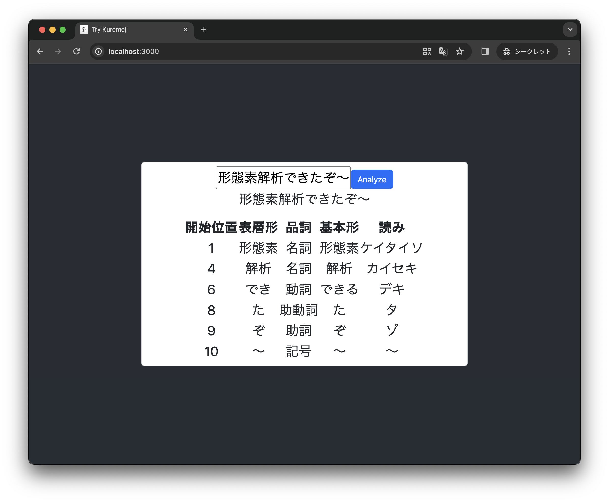
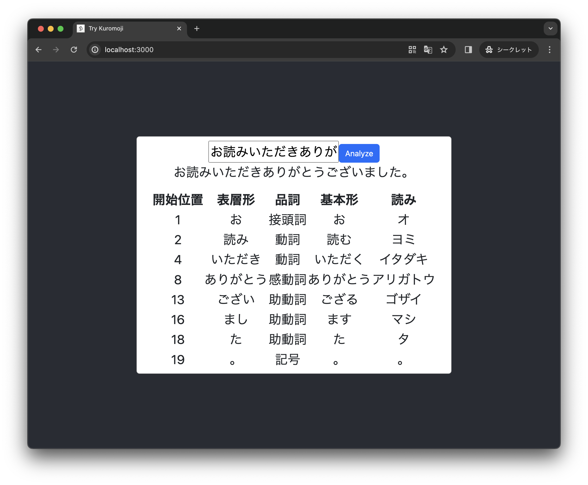

# React + Kuromoji.js で形態素解析

[**kuromoji.js**](https://github.com/takuyaa/kuromoji.js) （日本語形態素解析器 Kuromoji の JavaScript実装）と React で簡単なブラウザアプリを作ってみました。形態素解析器は MeCab や JUMAN、Sudachi など、他にもいろいろありますが、kuromoji.js は JavaScript で動くので、ブラウザアプリを作る時にバックエンドサーバなしで形態素解析が可能なのがうれしいですね。

作ったやつ。入力ボックスに文章を入力して「Analyze」ボタンを押すと、形態素解析結果が表形式で表示されます。

今回アプリを作るにあたり、**Webpackの設定**と**辞書ファイルの配置** でちょっと困ったので、メモを残しておきます。

## 履歴
- 2024/1/17 少し速くなりました。(refactor: Initialize kuromoji tokenizer only once at app mount)
- 2024/1/11 Qiita で記事を公開しました。[React + Kuromoji.js で形態素解析（Webpackの設定と辞書ファイルの配置） #React - Qiita](https://qiita.com/piijey/items/a7ff20da2f7d7315abb0)


## 準備
`nodejs 20.8.1` を使用しています。

Create React App でReactプロジェクトを生成します。
```sh
npx create-react-app try-kuromoji
```

[kuromoji.js](https://github.com/takuyaa/kuromoji.js) をインストールします。
```sh
npm install kuromoji
npm i --save-dev @types/kuromoji
```

## Reactアプリを作る
[`src/App.js`](./src/App.js) をご参照ください。

[Qiita記事](https://qiita.com/piijey/items/a7ff20da2f7d7315abb0) では、Analyze を実行するたびにトークナイザを初期化していましたが、最新版ではアプリのマウント時に一度だけトークナイザを初期化しているので、少し速くなっています。

## Webpack の設定
`npm start` で開発用サーバを起動したところ、次のようなエラーが出ました。

```log
BREAKING CHANGE: webpack < 5 used to include polyfills for node.js core modules by default.
This is no longer the case. Verify if you need this module and configure a polyfill for it.

If you want to include a polyfill, you need to:
        - add a fallback 'resolve.fallback: { "path": require.resolve("path-browserify") }'
        - install 'path-browserify'
If you don't want to include a polyfill, you can use an empty module like this:
        resolve.fallback: { "path": false }

webpack compiled with 1 error
```

エラーでは、Webpack 5 以降で Node.js のコアモジュールのポリフィル（ブラウザで Node.js モジュールを使用できるようにするための代替実装）がデフォルトでは含まれなくなったと言っています。kuromoji.js が内部的に Node.js の path モジュールを使用しているが、ブラウザ環境ではデフォルトでは利用できないため、エラーが発生しているようです。

解決策として、Webpackの設定でpathモジュールのポリフィルを追加しましょう。Create React App (CRA) で生成したプロジェクトでカスタムのWebpack設定を追加するためには、CRA の設定をオーバーライドする必要があるので、react-app-rewired を使用します。

ポリフィルを追加するための **path-browserify** と、CRAの設定をオーバーライドするための **react-app-rewired** をプロジェクトにインストールします。

```sh
npm install react-app-rewired path-browserify --save-dev
```

プロジェクトのルートディレクトリに `config-overrides.js` ファイルを作成し、Webpackの変更を書きます。
```js
// config-overrides.js
module.exports = function override(config, env) {
  config.resolve.fallback = {
    ...config.resolve.fallback,
    "path": require.resolve("path-browserify"),
  };
  return config;
};
```

`package.json` を編集し、react-app-rewired を使うようにします。

編集前
```json
  "scripts": {
    "start": "react-scripts start",
    "build": "react-scripts build",
    "test": "react-scripts test",
    "eject": "react-scripts eject"
  },
```

👇**編集後**
```json
  "scripts": {
    "start": "react-app-rewired start",
    "build": "react-app-rewired build",
    "test":  "react-app-rewired test",
    "eject": "react-app-rewired eject"
  },
```

編集したら、`package-lock.json` を削除し、`npm install` と `npm start` を再実行します。

## 辞書ファイルの配置
ブラウザでアプリを実行すると、次のようなエラーが出ました。
```log
ERROR
invalid file signature:60,33
    at __webpack_modules__../node_modules/zlibjs/bin/gunzip.min.js.$.g (http://localhost:3000/static/js/bundle.js:48639:40)
    at xhr.onload (http://localhost:3000/static/js/bundle.js:13528:26)
```

ブラウザの開発者ツールの "Network"タブを確認すると、`/kuromoji-dict/base.dat.gz` などの辞書ファイルの Status が "304" となっていることがわかります。辞書ファイルにアクセスできていないようです。

npm でインストールした `kuromoji/dict/` 下のファイルを、ブラウザがアクセスできる `public/` 下に配置します。次のようにディレクトリごとコピーしました。

```sh
cp -r node_modules/kuromoji/dict public/kuromoji-dict
```

*※辞書ファイルはgzip形式（.gz拡張子）で圧縮されていますが、我々が手作業で解凍する必要はありません。*

辞書ファイルを配置したパスと、`src/App.js` で指定したパス `dicPath: "/kuromoji-dict/"` が一致していることを確認します。辞書ファイルにアクセスできていれば、ブラウザの開発者ツールの "Network"タブで辞書ファイルの Status が "200" になります。

## 以上です
形態素解析を活用して楽しいアプリを開発しましょう。


