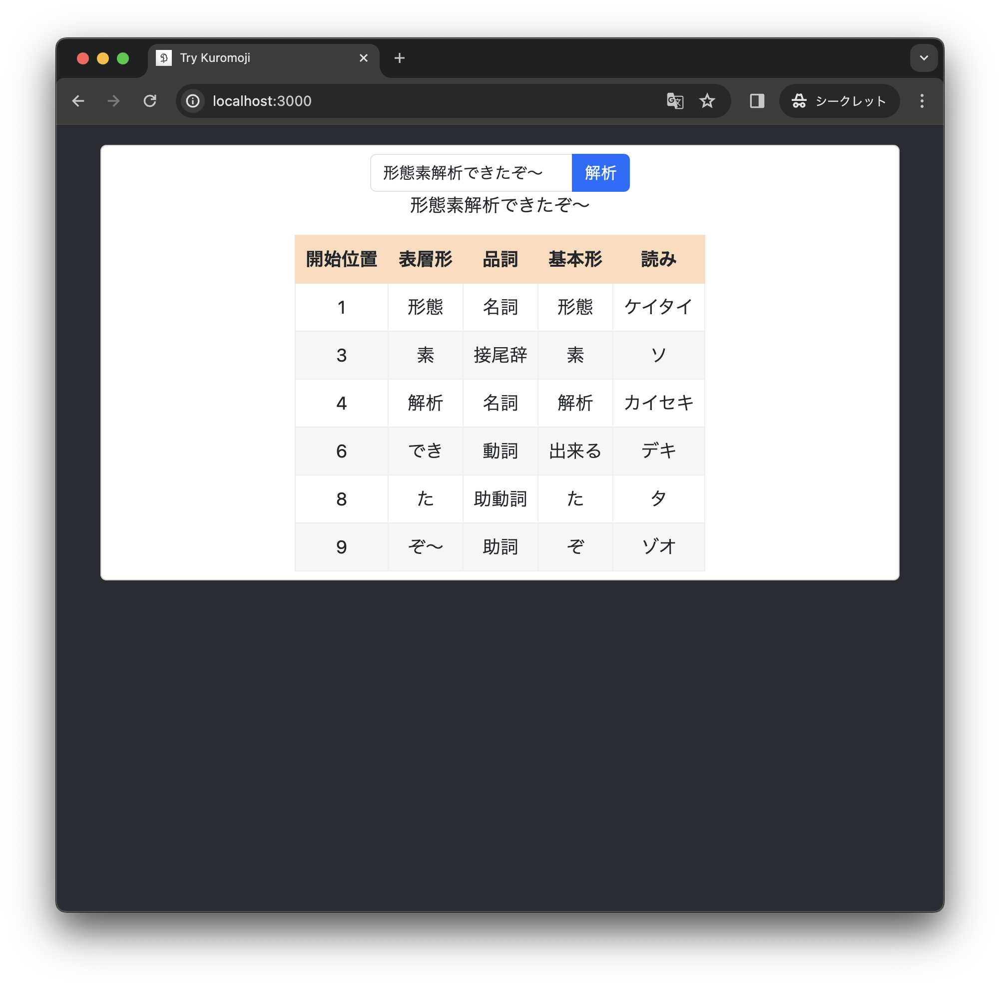

# React + Kuromoji.js + UniDic で形態素解析

kuromoji.js と React で簡単なブラウザアプリを作ってみました。

Qiita に投稿した記事に関連するリポジトリです。

- 2024/01/11 [React + Kuromoji.js で形態素解析（Webpackの設定と辞書ファイルの配置） - Qiita](https://qiita.com/piijey/items/a7ff20da2f7d7315abb0)
- 2024/03/08 [kuromoji.js + UniDic で形態素解析（辞書のビルド） - Qiita](https://qiita.com/piijey/items/f95a0527208fdd2557bc)

## 履歴
- 2024/01/11 Qiita で記事を公開しました
- 2024/01/17 少し速くなりました (refactor: Initialize kuromoji tokenizer only once at app mount)
- 2024/03/09 Qiita で記事を公開しました
  - トークナイザのロードにかかる時間をコンソールログに表示
  - UniDic をコピーするスクリプト [`copy_unidic.sh`](./copy_unidic.sh) を追加
