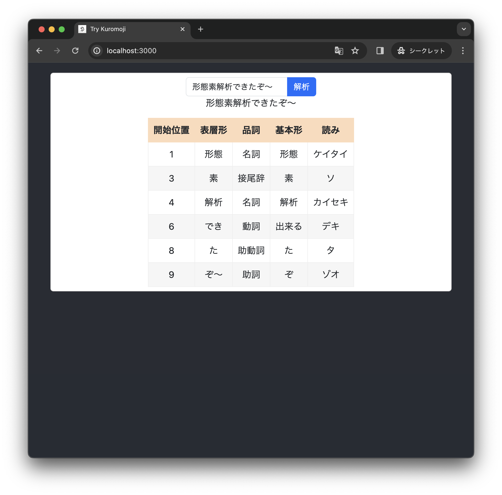

# kuromoji.js + UniDic で形態素解析（辞書のビルド）
2024/03/08  
[kuromoji.js + UniDic で形態素解析（辞書のビルド） - Qiita](https://qiita.com/piijey/items/f95a0527208fdd2557bc)

**[kuromoji.js](https://github.com/takuyaa/kuromoji.js)** （日本語形態素解析器 Kuromoji の JavaScript実装）と React でブラウザアプリを作っています。kuromoji.js はデフォルトでは [IPADic \(mecab-ipadic-20070801\)](https://github.com/taku910/mecab/tree/master/mecab-ipadic) を利用していますが、IPADic は現時点では更新が止まっており、辞書は新しいのがよい…… ということで、今回は **UniDic 最新版（[unidic-cwj-202302](https://clrd.ninjal.ac.jp/unidic/back_number.html#unidic_cwj)）を kuromoji.js 用にビルドして使ってみる**ことにしました。

結果として、ブラウザアプリで UniDic 最新版を使って形態素解析を動かすことができました。

ただし、UniDic は IPADic に比べてデータ量が多いことに注意が必要です。パソコンのブラウザ（自分の M1 iMac + Chrome）では動作を確認できましたが、スマホなどリソースの限られた環境では難しいようです（自分の iPhone 12 mini + Safari ではうまく動かなかったです）。スマホで動かすための追加の対処は、今後の課題とします。

それでは、UniDic をビルドしていきましょう。

1. 準備
   - Node.js のインストール、kuromoji.js のセットアップ
   - IPADic をビルドできるか確認
   - UniDic のダウンロード
2. UniDic を辞書ビルダが参照するディレクトリに配置
3. UniDic を kuromoji.js でビルド
4. おまけ：ブラウザアプリでの利用、UniDicでかすぎる

## 1. 準備
### 1.1. Node.js のインストール、kuromoji.js のセットアップ
辞書をビルドする前に、kuromoji.js に同梱されたIPADicを利用して動作を確認しておくといいかと思います（私は自作の React アプリで kuromoji.js を利用しています）。
```sh
node -v
# v20.9.0
```

- kuromoji.js で形態素解析するためのサンプルコードは、[kuromoji.js](https://github.com/takuyaa/kuromoji.js) の README にあります
- 以前の記事 [React + Kuromoji.js で形態素解析（Webpackの設定と辞書ファイルの配置） #React - Qiita](https://qiita.com/piijey/items/a7ff20da2f7d7315abb0) に、React で kuromoji.js を利用する際のセットアップについて書いたので、もし興味があれば参考にしてみてください

辞書のビルドの際には Node.js の古いバージョンをインストールして使用します。nvm や conda などを利用してバージョンを管理するとよいでしょう。  
```sh
node -v
# v10.16.3
```

- kuromoji.js はトークナイザの実行時には Node.js の新しいバージョン（v20）で動くのですが、辞書をビルドしようとした際は `ReferenceError: primordials is not defined` エラーが出ました
- v10.16.3 を選択したのは、先人の知恵 [\[JavaScript\] kuromoji.js の辞書に単語を追加する | 「それなら猫の手で」](https://neko-note.org/kuromoji-js-add-words/631) を参考にしたためです（このページによると「おそらく node 11 でも大丈夫です」とのことですが）

### 1.2.  IPADic をビルドできるか確認
kuromoji.js の辞書ビルダを、さきほどインストールした Node.js の古いバージョンで実行します。
```sh
cd node_modules/kuromoji/
node -v
# v10.16.3
npm install
npm run build-dict
```

- `npm run build-dict` によって実行されるコードは、`gulpfile.js` に書かれています
- ビルドする元になる辞書は、`node_modules/mecab-ipadic-seed/lib/dict/` 下に配置されています（デフォルトでは IPADic (mecab-ipadic-20070801) が入っています）

ビルドがうまくいけば、`dict/` 下に `*.dat.gz` ファイルが生成されます。
ビルドされた IPADic は、（もしまだであれば）どこかにコピーしておきます。

```sh
cp -r dict ../../public/kuromoji-dict
```

### 1.3. UniDic のダウンロード
[「UniDic」国語研短単位自動解析用辞書|バックナンバー](https://clrd.ninjal.ac.jp/unidic/back_number.html#unidic_cwj) から、フルパッケージ版 `unidic-cwj-202302_full.zip` をダウンロードし、解凍します。
```
$ ls unidic-cwj-202302_full/
README_unidic-cwj_full.txt left-id.def                model.bin
unk.def                    char.bin                   lex.csv
model.def                  unk.dic                    char.def
license                    rewrite.def                dicrc
matrix.bin                 right-id.def               feature.def
matrix.def                 sys.dic
```

- UniDic にはバージョンが複数ありますが、ビルドに必要な `matrix.def, char.def, unk.def` がダウンロードしたファイルの中にあることを確認しておきます（解析用軽量版にはこれらのファイルが入っていないので注意）

## 2. UniDic を辞書ビルダが参照するディレクトリに配置
kuromoji.js の辞書ビルダは、元の辞書を読み込むために、`mecab-ipadic-seed` モジュールを使用しています。

モジュールが参照する辞書ディレクトリには IPADic が入っているので、退避しておきます。
```sh
cd node_modules/kuromoji/
mv node_modules/mecab-ipadic-seed/lib/dict node_modules/mecab-ipadic-seed/lib/dict-ipadic
mkdir node_modules/mecab-ipadic-seed/lib/dict
```

さきほどダウンロードした UniDic のファイル（`../../unidic-cwj-202302_full/`下に展開した`*.def`）を、辞書ディレクトリにコピーします。
```sh
cp ../../unidic-cwj-202302_full/{matrix.def,char.def,unk.def} node_modules/mecab-ipadic-seed/lib/dict/
```

辞書CSVファイルは、カラムの並び順を IPADic に合わせてコピーします。
```sh
awk -F',' 'OFS="," {print $1,$2,$3,$4,$5,$6,$7,$8,$9,$10,$15,$25,$14}' ../../unidic-cwj-202302_full/lex.csv > node_modules/mecab-ipadic-seed/lib/dict/lex-mod.csv
```

### `lex-mod.csv` のカラムについて
UniDic の `lex.csv` は、 IPADic の `*.csv` よりも素性の列数が多く、並び順も微妙に異なるので、対応すると思われる部分のみを抜き出して並べ替えました。

- UniDic の `lex.csv` の各列が何を表しているかについては、[2akki（@zakki）さんのツイート](https://twitter.com/zakki/status/920977351059554304) と [UniDic 3.1.1 を使いたい #Python - Qiita](https://qiita.com/tetutaro/items/c3ab17b5e949648d0c4f) を参考にしました
- kuromoji.js がビルド時・実行時に読む列は、ソースコードの2つの箇所で指定されています

```js
// node_modules/kuromoji/src/dict/TokenInfoDictionary.js
        var surface_form = entry[0];
        var left_id = entry[1];
        var right_id = entry[2];
        var word_cost = entry[3];
        var feature = entry.slice(4).join(",");  // 4カラム目から最後まで
```
```js
// node_modules/kuromoji/src/util/IpadicFormatter.js
    token.surface_form = features[0];
    token.pos = features[1];
    token.pos_detail_1 = features[2];
    token.pos_detail_2 = features[3];
    token.pos_detail_3 = features[4];
    token.conjugated_type = features[5];
    token.conjugated_form = features[6];
    token.basic_form = features[7];
    token.reading = features[8];
    token.pronunciation = features[9];
```

- （0始まりで）0から9列目までは IPADic と UniDic が対応しているようですが、10~12 列目は異なるので、次のように対応づけました（たぶん合ってるはず…）

| IPA csv | kuromoji.js         | UniDic csv | UniDic の列名 | UniDic の列名 | awk |
|---------|---------------------|------------|------------|------------|-----|
| 10      | token.basic_form    | 14         | orthBase   | 書字形基本形     | $15 |
| 11      | token.reading       | 24         | kana       | 仮名出現形      | $25 |
| 12      | token.pronunciation | 13         | pron       | 発音形出現形     | $14 |

- アプリケーションの要件に応じて UniDic のもつ素性をフルで活用するには、`lex.csv` をそのままコピーしてビルドし、実行時に素性を取得する `IpadicFormatter.js` を UniDic 用に改修することも考えられます

## 3. UniDic を kuromoji.js でビルド

UniDic の辞書データは IPADic に比べて大きいので、Node.js のヒープメモリの最大サイズを（ここでは4GBに）増やして実行します。
```sh
NODE_OPTIONS="--max-old-space-size=4096" npm run build-dict
```

- デフォルトのヒープメモリで `npm run build-dict` を実行すると、`FATAL ERROR: Ineffective mark-compacts near heap limit Allocation failed - JavaScript heap out of memory` エラーが出ました

実行するとこんな感じ。`Finishied to read token info dics` が表示されてから、（`matrix.def` を読んでいる間、）しばらく待ちます。UniDic の `matrix.def`は大きい。

```sh
$ NODE_OPTIONS="--max-old-space-size=4096" npm run build-dict

> kuromoji@0.1.2 build-dict /my/project/path/node_modules/kuromoji
> gulp build-dict

[00:45:34] Using gulpfile /my/project/path/node_modules/kuromoji/gulpfile.js
[00:45:34] Starting 'clean'...
[00:45:34] Starting 'clean-dict'...
[00:45:34] Finished 'clean-dict' after 3.6 ms
[00:45:34] Finished 'clean' after 9.44 ms
[00:45:34] Starting 'build'...
[00:45:35] Finished 'build' after 303 ms
[00:45:35] Starting 'build-dict'...
[00:45:35] Starting 'create-dat-files'...
[00:45:35] Finished 'build-dict' after 14 ms
Finishied to read char.def
Finishied to read unk.def
Finishied to read token info dics
Finishied to read matrix.def
Finishied to read all seed dictionary files
Building binary dictionary ...
[00:49:12] Finished 'create-dat-files' after 3.62 min
[00:49:12] Starting 'compress-dict'...
[00:49:38] Finished 'compress-dict' after 25 s
[00:49:38] Starting 'clean-dat-files'...
[00:49:38] Finished 'clean-dat-files' after 12 ms
```

ビルドがうまくいけば、`dict/` 下に `*.dat.gz` ファイルが生成されます。
ビルドされた UniDic を、アプリケーションが参照できる位置にコピーします。

```sh
cp -r dict ../../public/kuromoji-dict-unidic
```

## 4. おまけ：ブラウザアプリでの利用、UniDicでかすぎる

トークナイザをロードする際に渡す辞書のパスを、さっきビルドした UniDic に変更します。
```js
// App.js
kuromoji.builder({ dicPath: process.env.PUBLIC_URL + "/kuromoji-dict-unidic/" }).build(function (err, tokenizer) { //...
```

- React で kuromoji.js を利用する際のセットアップについては、以前の記事 [React + Kuromoji.js で形態素解析（Webpackの設定と辞書ファイルの配置） #React - Qiita](https://qiita.com/piijey/items/a7ff20da2f7d7315abb0) に書きました




**成功です！**

### UniDic でかすぎる

でも、少々困ったことになりました。アプリをパソコンのブラウザ（自分の M1 iMac + Chrome）で実行すると、トークナイザのロードにかかる時間は、デフォルトの IPADic の場合では 0.8 秒ほどなのに対し、今回ビルドした UniDic では 12 秒ほどかかります。一度ロードしてしまえば、形態素解析の実行にかかる時間は気にならないので、パソコンでちょっと形態素解析を試してみよう！という目的ならまあ許容できるかな、という程度です。

しかし、スマホ（iPhone 12 mini + Safari）では、トークナイザのロードにめちゃくちゃ時間がかかったあと、形態素解析がうまく動きませんでした。形態素解析を利用したアプリ（私は[しりとりぼっと](https://piijey.github.io/shiritori/)を作っています）で UniDic を利用するには、課題が残ります。

ビルドした  `dict/` ディレクトリのサイズを確認してみると、IPADic の 17MB に対して、 UniDic では 480MB でした。 UniDic では `cc.dat.gz`（接続コスト）がサイズのほとんどを占めていることがわかります。

元はといえば、UniDic の `matrix.def` ファイルが大きいことが原因です。接続コストは語彙の組み合わせの数だけ考えられるので、語彙が多ければそれだけ接続コストのデータ量も増えると予想できます。UniDic の語彙数（csvファイルの行数）は IPADic の倍あるので、語彙数が2倍になれば、接続コストの数は4倍に増えると予想できるわけですが、`matrix.def` の行数は約230倍になっています。UniDic、でかすぎる…… 精度が高いんでしょうか。

| 辞書                              | 語彙数        | matrix.def  | matrix.def | cc.dat.gz               |
|---------------------------------|------------|-------------|------------|-------------------------|
|                                 | csvファイルの行数 | 行数          | size       | size                    |
| IPADic<br>mecab-ipadic-20070801 | 392,126    | 1,731,857   | 22M        | 1.6M                    |
| UniDic<br>unidic-cwj-202302     | 876,803    | 399,848,519 | 59G        | 453M                    |
| IPADic → UniDic での変化            | 約2倍        | 約230倍‼️      |            | kuromoji.js でビルド・圧縮したもの |

少々精度を犠牲にしてでも、 `matrix.def` を切り詰めてデータ量を削減するか。スマホで動かすための追加の対処は、今後の課題とします（アイデアをお持ちの方、教えてください〜！）。


